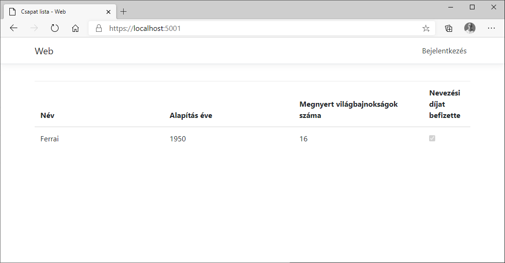
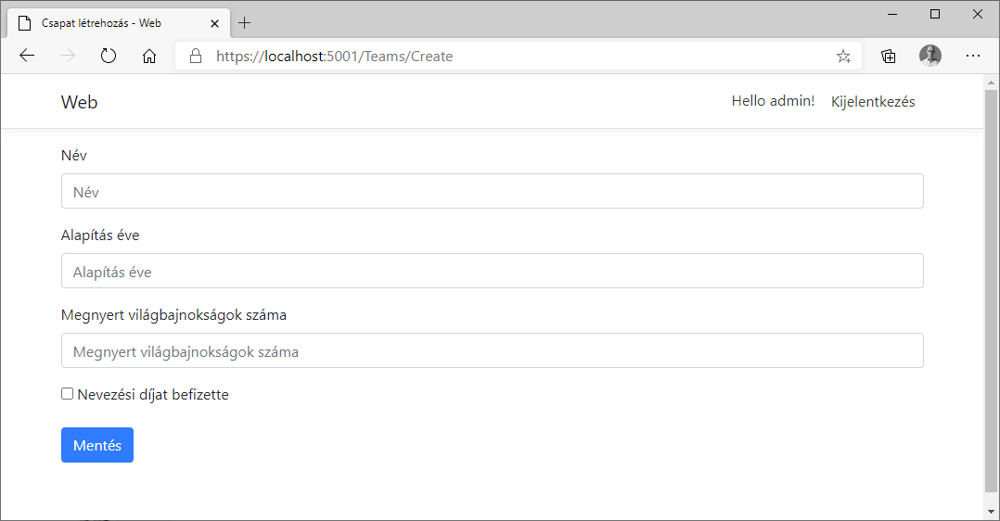
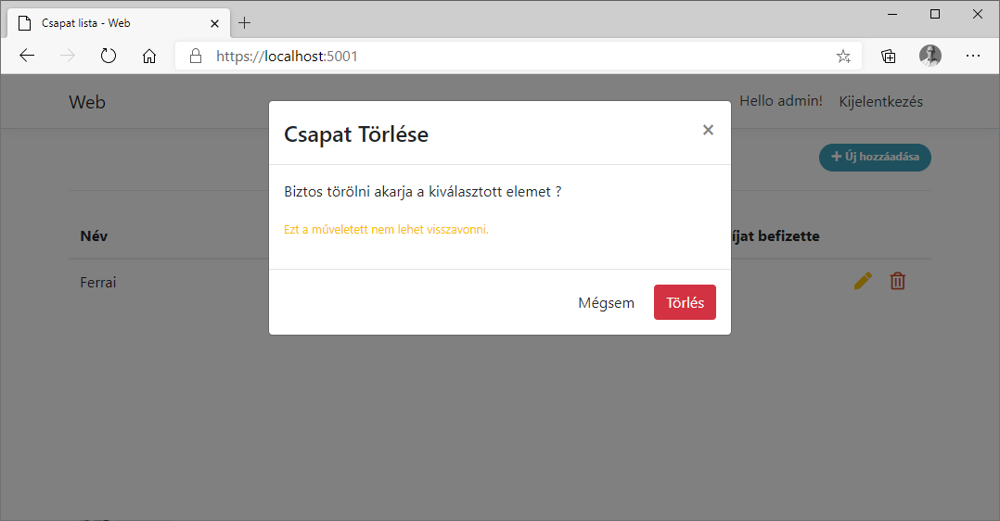

# Feladat
Egy ASP.NET Core 3.1 Razor Pages demo Webalkalmazás az alábbiak bemutatására:
* Az architektúra a [eShopOnWeb](https://github.com/dotnet-architecture/eShopOnWeb)-ban bemutatott [Clean architecture](https://docs.microsoft.com/en-gb/dotnet/architecture/modern-web-apps-azure/common-web-application-architectures#clean-architecture) alapján készült
* EF Core SQLite memory db-vel
* Repository pattern
* Code First migration
* ASP.NET Identity Core 
* Alap CRUD műveletek, a létrehozás, módosítás és a törlés authorizációhoz kötött
* Design: Bootstrap 4
* Functional, Integration és Unit tesztek
* Admin test jelszó admin, jelszava pedig: test2020

# Development
A solution gyökérben: 
- dotnet tool restore
- dotnet ef migrations add Init --context AppIdentityDbContext --startup-project .\src\Web --project .\src\Infrastructure\ --output-dir Identity\Migrations
- dotnet ef migrations add Init --context Forma1Context --startup-project .\src\Web --project .\src\Infrastructure\ --output-dir Data\Migrations

# Bootstrap snippets
[Bootsnipp](https://bootsnipp.com/)
[Bootstrap 4 Snippets](https://www.tutorialrepublic.com/snippets/gallery.php)
[Bootstrap Table Snippet](https://www.tutorialrepublic.com/snippets/preview.php?topic=bootstrap&file=table-with-add-and-delete-row-feature)

# Képek az alkalmazásról

